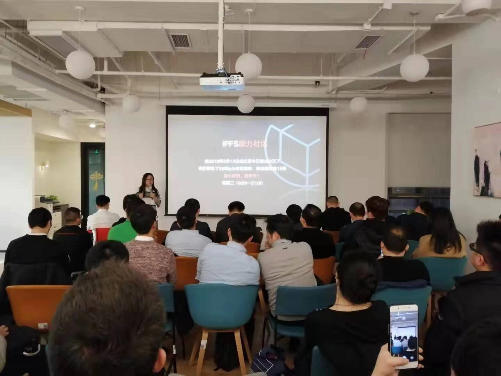
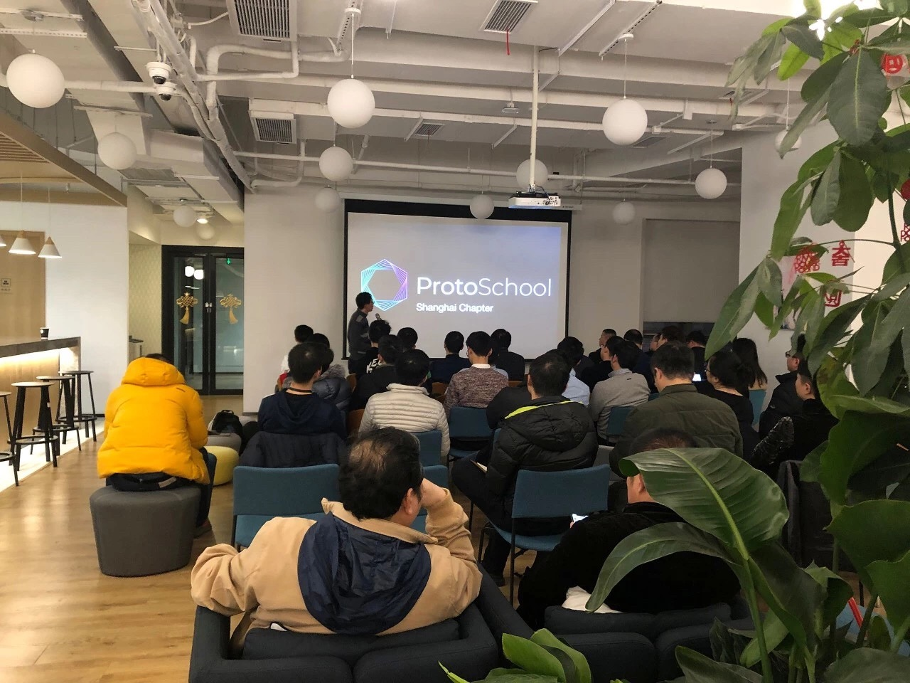
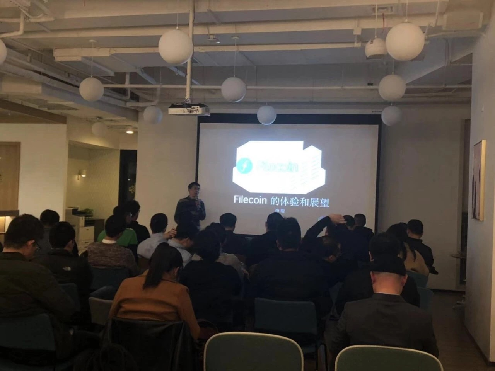
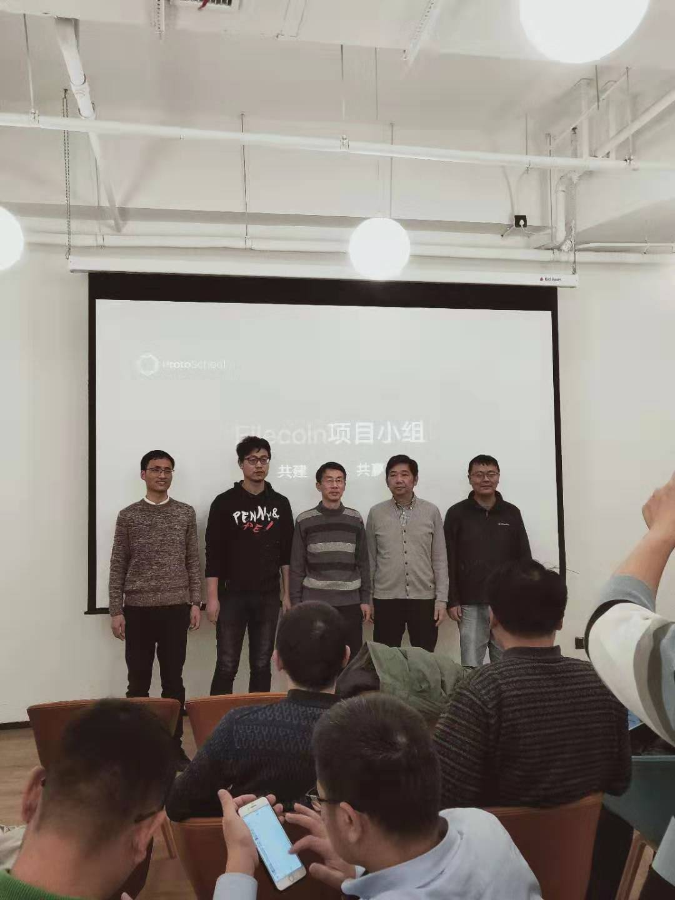
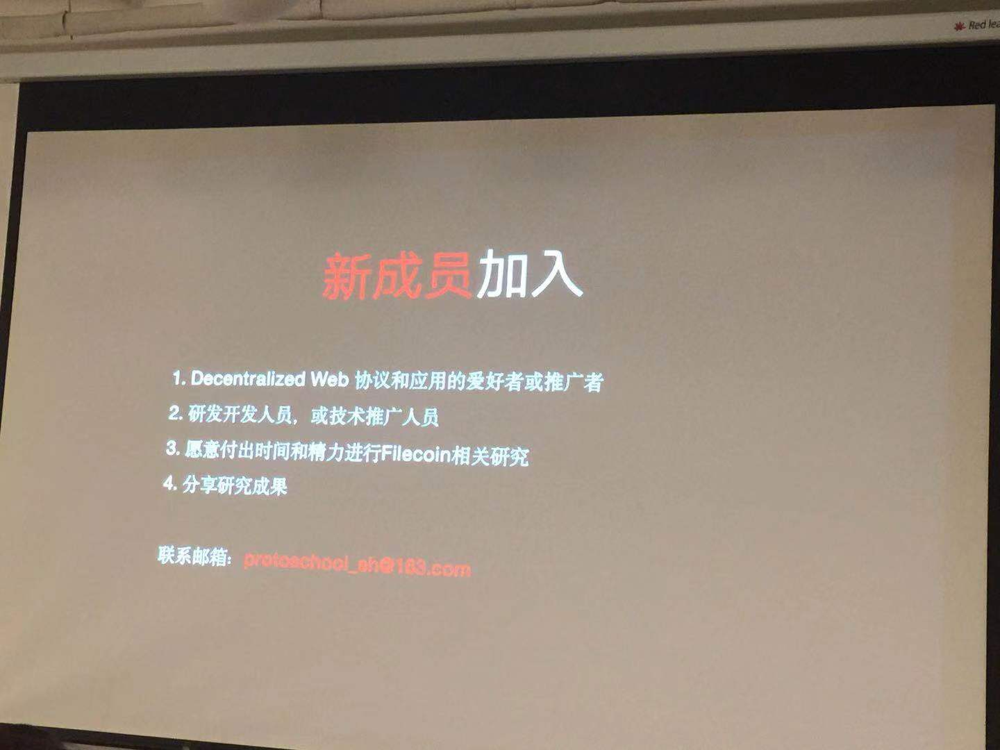

# ProtoSchool Shanghai Chapter Openness 

> Date:  Feb. 16 2019 
> 
> Venue:  Huobi Club, Shanghai 
> 
> Sponser: IPFS-Force Community 
> 
> Details, see: [Activity Post](http://www.huodongxing.com/event/4480463696800?td=5082797945342)

## Agenda
- ProtoSchool Openness 
  - IPFS-Force Community Introduction - Huijuan Sun
  - ProtoSchool & Shanghai Chapter Introduction - Steven Li
  - LD Research Introduction - Django Peng
- Knowledge sharing
  - Filecoin Installation and Running -  Penghui Yan
  - Filecoin initial experience and outlook - Steven Li
- Filecoin Study Group Setup  

 

## Materials
- [ProtoSchool Introduction & Shanghai Chapter Openness](20190216-Openness/ProtoSchoolShanghaiChapterOpenness.pdf)
- [Filecoin Quick Start](20190216-Openness/FilecoinQuickStart.pdf)
- [Filecoin Initial Experience & Outlook](20190216-Openness/FilecoinInitialExpAndOutlook.pdf)
- [Filecoin Study Team](20190216-Openness/FilecoinStudyTeam.pdf)

## Pictures - have fun
IPFS Force Community - the Sponser speaking - Huijuan Sun:

 

LD Research Introduction - Django Peng

 

ProtoSchool Introduction & Shanghai Chapter Openness - Steven Li:

 
<!-- 
Filecoin Quick Start - Penghui Yan:

 
-->

Filecoin Initial Experience & Outlook - Steven Li:

 

Filecoin Study Team:

