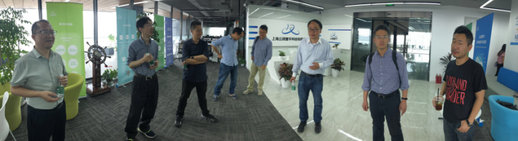
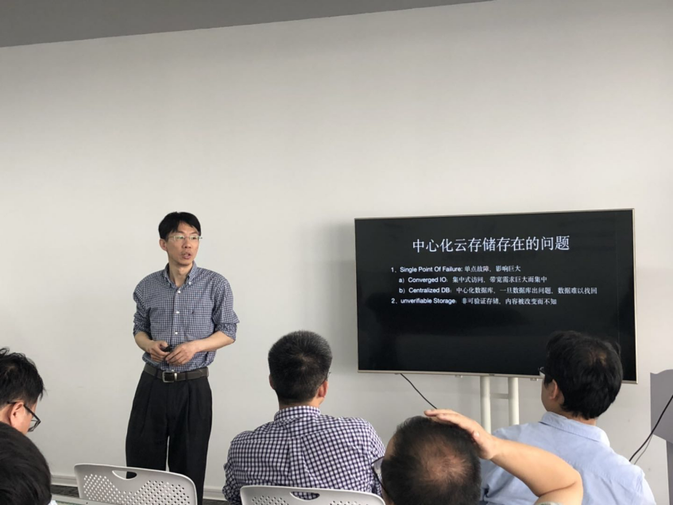

# ProtoSchool Shanghai Chapter - 2nd Session (IPFS Evaluation / Filecoin Architecture / VDF Introduction) 

> Date:  May 19 2019 
> 
> Venue:  Jinghe Center, Shanghai 
> 
> Sponser: IPFS-Force Community 
> 
> Details, see: [Activity Post](https://www.meetup.com/Shanghai-Decentralized-Systems-Meetup-Group/events/261316024/)

## Agenda
- Openness
- Technical sharing
  - Cloud Storage System Evolution led by IPFS - Steven Li
  - Filecoin Blockchain Framework and Mining Analysis - Star Li
  - VDF principle and application - Taosheng Shi
- Open Discussion 

 

## Summary
This is a real deep-dive discussion of IPFS and Filecoin related topics, and very attractive to developers and researchers. 
The 3 speakers present their research and ideas regarding distributed storage, blockchain and how they bundle together, not only
 from technical point of view, but how it might evolve in near future or long run. 

 After the end of this session, all the attendees expect we could regularly have this kind of session to focus on protocol and 
 implementation, which is quite different than other 'popular' sessions which are more focusing on business or investment.

 

## Materials
- [Cloud Storage Evalution led by IPFS](20190519-2ndSession/CloudStorageEvolutionLedByIPFS.pdf)
- [Filecoin Blockchain Storage Protocol](20190519-2ndSession/FilecoinBlockchainStorageProtocol.pdf)
- [VDF theory and its applications](20190519-2ndSession/VDF-TheoryAndApplications.pdf)

## Pictures - have fun
This activity is held in Jinghe Center - a beautiful place

 

Cloud Storage Evalution led by IPFS - Steven Li

 

VDF theory and its applications - Taosheng Shi:

