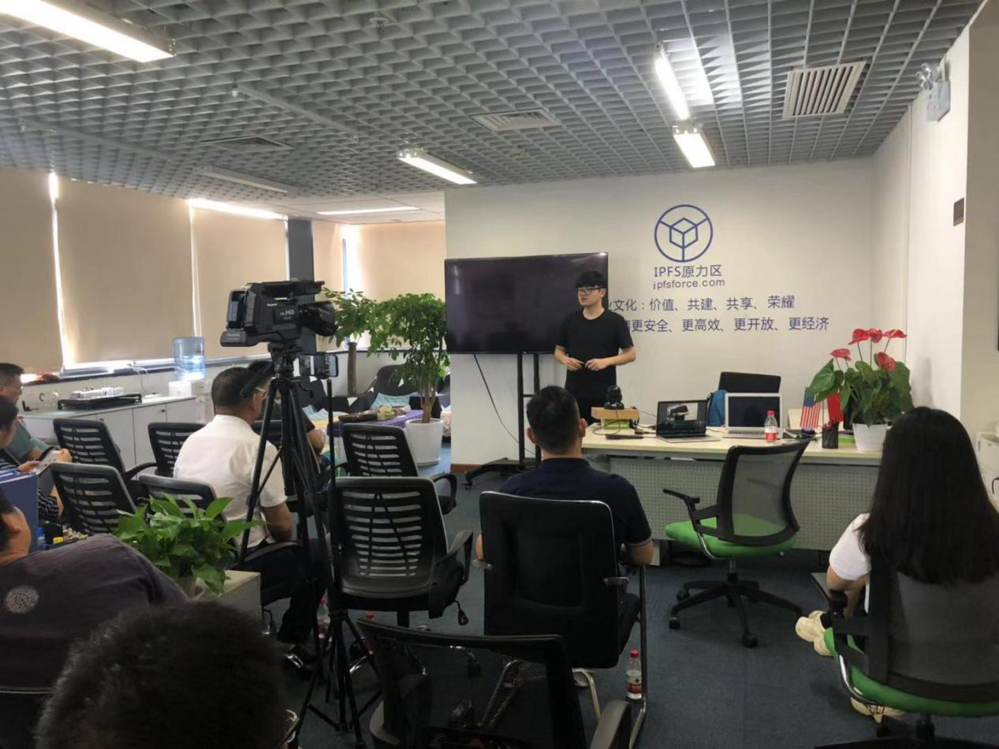

# 活动回顾--『协议学院 · 上海分院 · 技术沙龙』第四期 

2019.7.28日上海徐汇区，「协议学院上海 · 技术沙龙」第四期如期举行，该活动由协议学院（ProtoSchool）上海分院主办、IPFS原力区承办。
“协议学院”是一个面向开发者和技术人员的非营利学习社区，协议学院上海分院举办活动的目的在分享及传授分布式、Dweb、区块链等相关的数据结构、底层协议、共识算法以及工具服务等知识。
本此活动采用演讲式分享，内容主题分别为【IPFS Camp2019亮点】、【zkSNARK入门】、以及【去中心化数据结构】，现场嘉宾和观众进行了深入的探讨交流。

活动现场由承办方IPFS原力区的华仁斌主持，首先对远道而来的嘉宾及全国各地的参会者表示欢迎，然后简要介绍了“协议学院”及承办方“IPFS原力区”，随后进入了嘉宾演讲环节。
本次活动分享嘉宾分别为李昕（协议学院上海分院组织者）、李星（Dora网络CTO），及达宇（IPFS原力区项目研究经理），以下为活动内容回顾。

## Part I
首先是李昕带来的《IPFS Camp2019亮点分享》，主要分享6月底7月初IPFS官方在巴塞罗那举办的技术极客夏令营过程中碰撞出的新兴想法、活动趣事及大量技术分享活动中的高光时刻。
李昕提到，这60小时排期满满，无论是技术干货还是闪电演讲，无论是团队合作还是良性比赛，每时每刻精神紧绷又兴奋。
整个活动全权由IPFS团队运作，没有商业运作和投资分析，工作人员不多但机动性超强并充满活力。160个参会人员共同经历了核心课程、选修课程、闪电演讲、海报项目等等。
最后，在自由话题讨论中，活动临近尾声，李昕表示官方“颁发”的这个“成绩证书”十分有意义，我们在做的事情更是充满价值、自由。

更多细节请参阅[演讲PPT](20190728-4thSession/李昕：IPFS Camp Highlights.pdf)。

 

## Part II
来自Dora网络的CTO李星分享关于零知识证明的《zkSNARK入门》，从什么是zkSNARK、什么是QAP等切入，由浅入深引出函数、多项式等技术思路。
随后聊到Circuit Flattening及利用Circuit Flattening解决R1CS多项式里S数据的确认。
最后李星浅谈椭圆曲线--Groth 16的运用，并留下开放性问题引发全场讨论。

喜欢技术的同学可以参考演讲 [PPT](20190728-4thSession/李星：zk-SNARK入门.pdf)，对细节感兴趣的可以与李老师联系。

 

## Part III
原力区达宇作为第三位分享嘉宾，带来《去中心化数据结构》，解读数据结构的本质及现实价值，对检索及传输的深远影响。
从去中心化数据结构的特性出发，阐述改变当前URL及Web的寻址运作方式、信任和效率提升的数据量化等。
分布式数据引入加密哈希，为搭建去中心化网络提供基础。
最后达宇讲解了去中心化数据结构的技术实现，主要包括：CID 、Merkle Tree、DAG。

[原版PPT](20190728-4thSession/达宇：IPFS去中心化数据结构.pdf) 在此

 
 
*以上即为协议学院上海分院第四期技术沙龙回顾，活动宗旨在于通过线下聚会及分享，在Dweb、分布式等领域共享近期各位大咖的观点与见解，互相学习，共同进步。*
