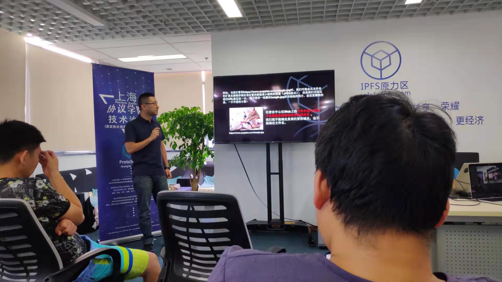

# ProtoSchool Shanghai Chapter - 4th Session (IPFS Camp highlights, zkSNARK introduction, Decentralized Data Structure) 

> Date:  July 28 2019 
> 
> Venue:  Room 902, No. 418, Guiping Road, Shanghai - Incubation Center, Caohejing Hi-tech Park  
> 
> Organizer/Sponser: ProtoSchool - Shanghai Chapter 
> Co-Organizer: IPFS Force Community, Dora Network
> 
> Details, see: [Activity Post](https://www.meetup.com/Shanghai-Decentralized-Systems-Meetup-Group/events/262866233/)

## Agenda
- Openness
- IPFS Camp Highlights sharing - Steven Li
- Technical sharing
  - Zero knowledge proof -- Coda SNARK challenge - Star. Li
  - Distributed Data Structure - Yu Da
- Open Discussion 

 

## Summary
Hosted by Hua, Renbin, this meetup was focusing on technology sharing. Firstly, the Shanghai Chapter organizer Steven Li introduced IPFS Camp 2019, a 3-day technical discussion and exploration; Star Li, the expert of zero-knowledge proof, introduced how zk-SNARK works, and Da, Yu, the software architect from IPFS-Force community shared with the audiences of how decentralized data structure works. 

There are near 30 engineers joined this meetup, from different organization, including enterprises and colleges. 

 

## Materials
- [IPFS Camp Highlighs](20190728-4thSession/李昕：IPFS Camp Highlights.pdf)
- [zk-SNARK introduction](20190728-4thSession/李星：zk-SNARK入门.pdf)
- [Decentralized Data Structure](20190728-4thSession/达宇：IPFS去中心化数据结构.pdf)

## Pictures - have fun
Steven is sharing the experience in IPFS Camp 2019 (Spain) 

 

Star Li is introducing zk-SNARK:

 

Yu Da is talking about decentralized data structure:

