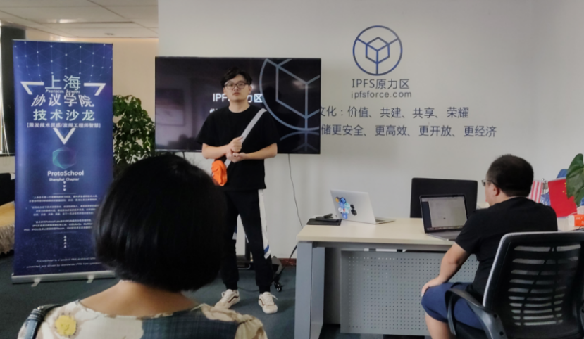
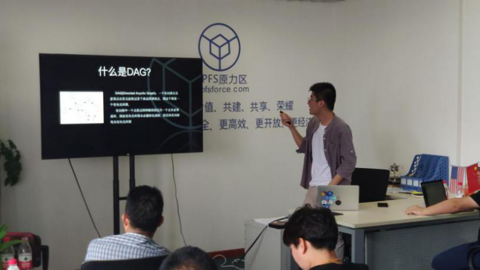
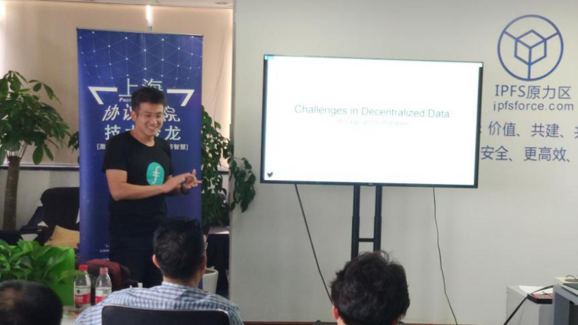
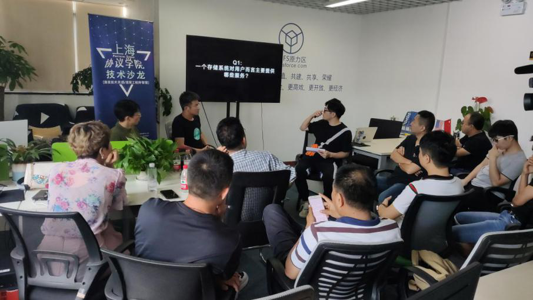

# ProtoSchool Shanghai Chapter - 4th Session (P2P data links with content addressing, Challengs in Decentralized Storage, Open discussion) 

> Date:  August 31 2019 
> 
> Venue:  Room 902, No. 418, Guiping Road, Shanghai - Incubation Center, Caohejing Hi-tech Park  
> 
> Organizer/Sponser: ProtoSchool - Shanghai Chapter 
> Co-Organizer: IPFS Force Community, Dora Network
> 
> Details, see: [Activity Post](https://www.meetup.com/Shanghai-Decentralized-Systems-Meetup-Group/events/263835810/)

## Agenda
- Openness
- P2P data links with content addressing - Fuliang Zheng
- Technical sharing
  - Questions and Challenges of Blockchain Storage - Taosheng Shi
- Open Discussion - Steven Li and Others

 

## Materials
- [P2p data links with content addressing - Chinese version](20190831-5thSession/P2PdataLinksWithContentAddressing-Chinese.md)
- [Training video](https://www.youtube.com/watch?v=E1Gc8gn-5CI&t=3s)

## Pictures - have fun
The host: Renbin Hua

 

Fuiliang Zheng is introducing DAG:

 

Taosheng Shi is talking about challenges in Decentralized Storage:

 

The open discussion is hot:

