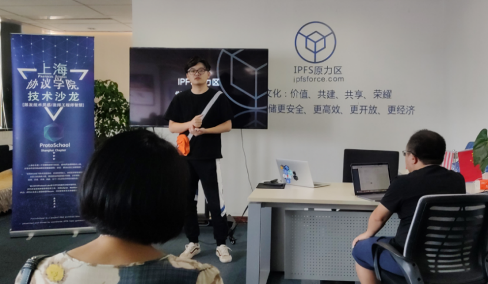
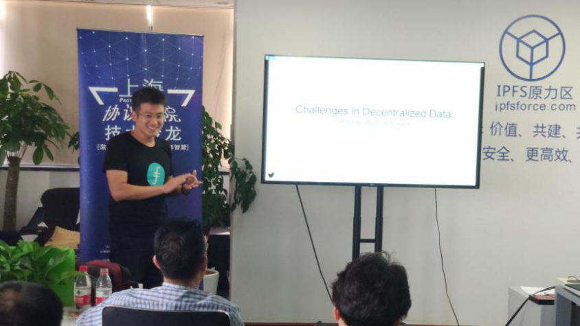

# 活动回顾--『协议学院·上海·技术沙龙』第五期

2019年8月31号，由协议学院（ProtoSchool）·上海分院主办，IPFS原力区承办的「协议学院·技术沙龙」与众多技术大咖齐聚（上海徐汇）桂平路418号国际孵化中心-A区 9楼902室。该活动是一个非营利的社区学习活动，面向开发者和技术人员，每期分享和传授DWeb相关的数据结构、协议、算法以及工具等知识。以开源的精神，价值、共建、共享、荣耀，为下一代分布式网络共建生态。
本期沙龙现场从【DAG操作】、【区块链存储的问题与挑战】，以及【圆桌讨论环节】等多主题、多形式进行深度分享、探讨与互动交流。

本期活动由原力区华仁斌主持。首先他对远道而来的嘉宾及参会者表示欢迎，并向大家介绍了协议学院、IPFS原力区、本次活动议程以及邀请嘉宾。
本次活动分享嘉宾分别为来自IPFS原力区的李昕（协议学院上海组织者）、郑富良、石涛声（协议学院成都组织者），以下为活动内容回顾。

## PartyⅠ

首先，来自原力区的郑富良作为第一个演讲嘉宾，为大家分享DAG操作。
DAG，中文名“有向无环图”。“有向”是指有方向，“无环”则指够不成闭环。在DAG中，没有区块的概念，他的组成单元是一笔笔的交易，验证手段则依赖于后一笔交易对前一笔交易的验证。

正在演示如何创建DAG并返回CIDA。在IPFS DAG API之中，他允许我们将数据对象存储在IPFS中，可以通过将数据对象传递给ipfs.dag.put方法来创建新节点，该方法返回新创建的节点的内容标识符（CID）。

实操教学，现场为我们演示创建DAG并返回CIDA、创建新节点并链接以及使用链接读取嵌套数据。
同时也展示了有向无环图（DAG）的另一个重要特征，是将他们链接在一起的能力。在IPFS DAG存储中表达链接的方式与CID另一个节点相同。

郑富良表示，他很喜欢和大家分享、交流。这是ProtoSchool课程，他作为分享者/传播者和大家分享IPFS相关知识。希望可以和大家多多交流，共同进步。

## PartyII

来自原力区石涛声为大家分享【区块链存储的问题与挑战】。同时石涛声也是协议学院·成都的组织者。这次受邀来上海作为嘉宾分享交流。
2019年8月23号分布式存储峰会在柏林召开，大会聚集了IPFS、Sia、Storj、ethereum swarm、Arweave、Filecoin等区块链存储领域的所有主流项目，可以说是一次难得的盛会。Jacob Eberhardt在大会开幕演讲给予他很大的启发。结合分布式存储峰会的见闻感受以及自己在数据存储和数据库等问题的思考做了一个总结和分享交流。

将数据存储在本地文件系统中有很多风险。
- 本地文件系统成为单点故障
- 当其他客户端请求数据时，本地文件系统成为瓶颈
- 客户端本身要负责数据的安全

由于本地储存的局限，中心化存储方案被提出。这种存储兼容了本地和远程两种方式，对于数据存储的安全性和使用的方便程度都有很大的提升。目前也是应用最广的存储模式。

随着技术的发展，点对点的去中心化存储系统慢慢进入存储行业。没有客户端和服务器，只有节点和对等节点。这些存储提供方不仅可以提供存储服务，也可以上传和下载数据。去中心化存储带来便捷的同时，也产生了其他问题。缺乏激励机制，节点服务过于随性甚至出现搭便车和水蛭吸血问题。这样的系统，没有可用性、持久性和性能的保证。

IPFS通过哈希加密，保证了数据的安全性。结合区块链为去中心化存储系统解决了激励机制的问题-Filecoin。

存储的问题与挑战，去中心化存储将是未来的发展方向。究竟如何才能更好的解决问题仍旧是我们需要攻克的难关。

## PartyIII

接下来是圆桌讨论环节，由原力区华仁斌作为主持人，组织大家就以下问题进行深入探讨。协议学院·上海/成都两位组织者李昕和石涛声作为嘉宾参与讨论。以下是讨论话题：
Q1:一个存储系统对用户而言主要提供哪些服务？
Q2:中心化存储存在哪些问题，为什么认为去中心化存储是未来的趋势？ 
Q3:数据存储在本地不好吗？为什么要存储到云上？
Q4:Bittorrent 出现在2001年，IPFS出现在2015年，它们都是去中心化的存储系统，这么多年为什么没有流行起来呢？ 
Q5:IPFS的激励层，一定要用 Filecoin 吗？ 
Q6:去中心化的激励层存在哪些挑战？
Q7:激励系统和存储系统，应当紧密结合吗？
Q8:在去中心化存储系统中，如何保护隐私？

大家都积极参与讨论环节。并对一些问题进行了深入探讨。

2001年Bittorrent出现，点对点的传输/存储方式第一次进入人们视线。他突破xp sp2连接数的限制，大大加快了下载速度，盛极一时。但因资源版权问题、缺少优质服务以及一些大型通讯公司的抵制，很快又被人们抛弃，昙花一现。
IPFS/Filecion技术发展需要吸取经验，建立良好的生态维护。路漫漫，任重道远。
以上即为协议学院·上海第五次线下技术沙龙回顾，旨在通过此次会议分享近期各位大咖的观点与见解。欢迎大家踊跃参与，我们下期再见。
