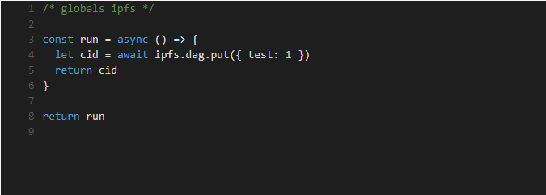
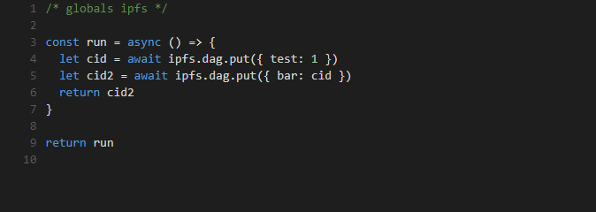
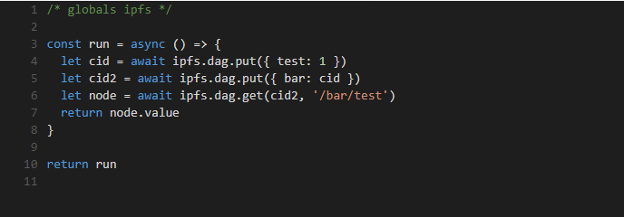

# P2P数据链接与内容寻址

使用IPFS和CID在对等托管数据集之间存储，获取和创建可验证链接。这是与朋友的图表。
- Lession1 创建节点并返回内容标识符（CID）
- Lession2 创建一个链接到旧节点的新节点
- Lession3 使用链接读取嵌套数据

## Lession 1 - 创建节点并返回内容标识符（CID）
**概念引入:**
CID - 内容标识符。IPFS中从其内容派生的数据块的唯一地址。

在本教程中，我们将探索IPFS DAG API，它允许我们将数据对象存储在IPFS中。（你可以在IPFS中存储更有趣的东西，比如你最喜欢的猫GIF，但是你需要使用不同的API。）
您可以通过将数据对象传递给ipfs.dag.put方法来创建新节点，该方法返回新创建的节点的内容标识符（CID）。

`ipfs.dag.put({ hello: 'world' })`

CID是IPFS中从其内容派生的数据块的地址。每当有人将相同的{ hello: 'world' }数据放入IPFS时，他们将获得与您得到的相同的CID。如果他们放入{ hell0: 'w0rld' }，CID将是不同的。
注意：在我们的课程中，我们将使用如下所示的代码编辑器。在run为您预先填充的函数中输入解决方案代码，确保在该函数中返回请求的值。（您不需要关心return run该行;这是代码编辑器的配置。）

**试试吧**
使用ipfs.dag.put以创建数据的节点{ test: 1 }。返回新节点的CID。
```javascript
1 /* globals ipfs */
    2
3 const run = async () => {
4   // your code goes here!
5   // be sure this function returns the requested value
  let newdag = ipfs.dag.put({ test: 1 })
  return newdag
6 }
7
8 return run
9 
```

**查看方案**



### Lesson 2 - 创建一个链接到旧节点的新节点
**概念引入:**
CID - 内容标识符。IPFS中从其内容派生的数据块的唯一地址。
DAG - 有向无环图。IPFS中的块形成一个图，因为它们可以通过其CID指向其他块。这些链接只能指向一个方向（指向），而整个图形中没有循环（无环）

有向无环图（DAG）的一个重要特征是将它们链接在一起的能力。
在IPFS DAG存储中表达链接的方式与CID另一个节点相同。
例如，一个节点可能有一个名为foo指向另一个先前保存为的CID实例的链接barCid，如下所示：
```javascript
{
  foo: barCid
}
```

当我们给一个字段命名并使其值成为CID的链接时，如上所示，我们称之为命名链接。
我们可以像添加任何其他数据一样添加IPFS的命名链接：
`await ipfs.dag.put({ foo: barCid }) ` 

**试试看**
创建一个名为bar的命名链接，该链接指向我们在第一课中创建的节点。把它放入IPFS并返回CID。
编辑器预先填充了创建我们链接到的节点的代码。
```javascript
1 /* globals ipfs */
2 
3 const run = async () => {
4   let cid = await ipfs.dag.put({ test: 1 })
5   // your code goes here 
   let cid2 = await ipfs.dag.put({ bar: cid })
   return cid2
6 }
7
8 return run
9
```

查看方案



### Lesson 3 - 使用链接读取嵌套数据
您可以使用路径查询从深层嵌套对象中读取数据。
```javascript
let cid = await ipfs.dag.put({
  my: {
    deep: {
      obj: 'is cool'
    }
  }
})
console.log(await ipfs.dag.get(cid, '/my/deep/obj'))
// prints { value: 'is cool', remainderPath: '' }
```

ipfs.dag.get允许使用IPFS路径进行查询，并返回我们称为节点的解码块。返回值是一个包含查询值和任何未解析的剩余路径的对象。
这个API很酷的一点是它也可以遍历链接。
```javascript
let cid = await ipfs.dag.put({ foo: 'bar' })let cid2 = await ipfs.dag.put({
  my: {
    other: cid
  }
})
console.log(await ipfs.dag.get(cid2, '/my/other/foo')) 
// prints { value: 'bar', remainderPath: '' }
```

请注意，此方法不返回值本身，而是返回包含value属性的对象。value在promise完成之前，您无法访问该属性，这个问题可以通过两种方式解决：
```javascript
// Option 1: Wrap your await statement in parentheses to let the promise complete
ipfs.dag.get(cid2, '/my/other/foo')).value

// Option 2: Save the result to a variable and then access its value
ipfs.dag.get(cid2, '/my/other/foo')
return node.value
```

**试试看**
使用ipfs.dag.get通过遍历上一个练习中放置的对象的链接返回test的值。（提示：确保在承诺完成后访问value属性。）

```javascript
1 /* globals ipfs */
2 
3 const run = async () => {
4   let cid = await ipfs.dag.put({ test: 1 })
5   let cid2 = await ipfs.dag.put({ bar: cid })
6   // your code goes here
   let node = await ipfs.dag.get(cid2, '/bar/test')
  return node.value
7 }
8
9 return run
10 
```

**查看方案**


