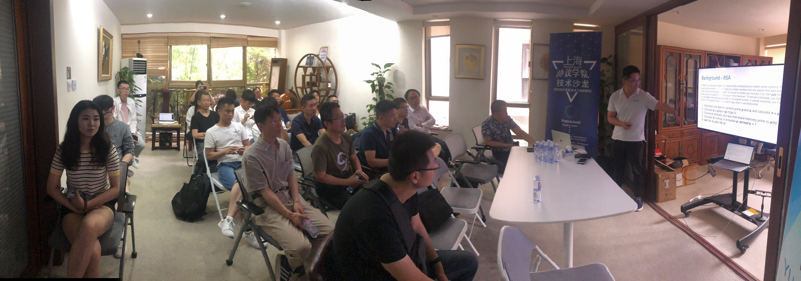
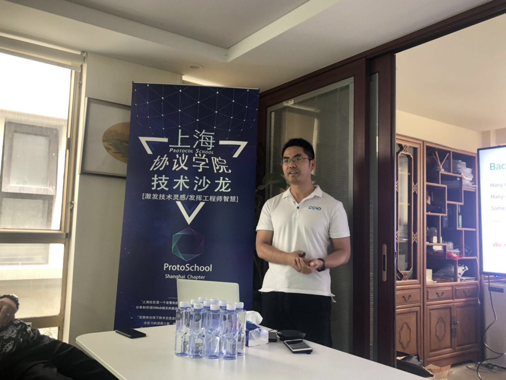
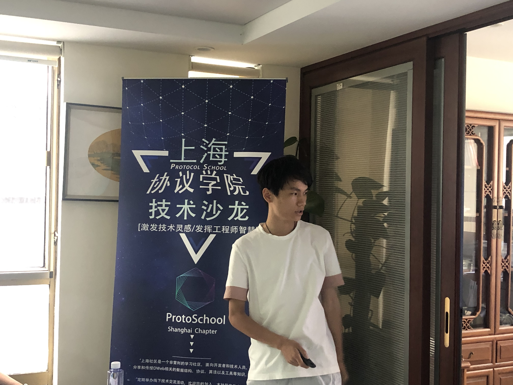

# 活动回顾--『协议学院·上海·技术沙龙』第三期

> 日期:  2019·06·15 
> 
> 地址:  上海市浦东新区松林路97弄海怡别墅41号
> 
> 主办单位: IPFS-Force 社区，
> 协办单位: IPFS-Force 社区，PPLabs
> 
> 详情, 请参阅: [活动发布](https://www.huodongxing.com/event/4494697487900)

## 议程
- 开放交流
- 技术讨论
  - 椭圆曲线密码学 - 蒋鑫
  - 基于IPFS的Web开发 - 骞永军
  - Filecoin预期共识的探索 - 李昕
- 公开讨论

 

## 摘要
这是一次在阳光明媚的下午持续约3.5小时的非常成功的技术会议活动。与上一期会议相比，我们有双倍的参会者，大约30名工程师参加了此次活动。本期三个主题对于开发人员和研究人员来说也非常有吸引，作为PPIO的密码工程师，Xin Jiang对ECC的工作方式进行了精彩的介绍，来自IPFS原力区的首席技术官Steven分析了共识的常识以及Filecoin如何通过简单的方式采用现有研究来实现其目标，及区块链的早期开发人员Yongjun Qian从西安出发，专门为此次活动介绍了如何开发基于IPFS的Web应用程序。

 

## 资料
- [椭圆曲线密码学](20190615-3rdSession/Elliptic_Curve_Cryptography.pdf)
- [基于IPFS的Web3.0开发](20190615-3rdSession/Elliptic_Curve_Cryptography.pdf)
- [预期共识 - Filecoin共识探索](20190615-3rdSession/FilecoinExpectedeConsensus.jpg)

## 现场照 - 记录瞬间
本次互动大约有30名工程师参与交流：

 

蒋昕正在分享椭圆曲线密码学 

 

基于IPFS的Web3.0开发实例 - 骞永军： 

 

Filecoin预期共识研究 - 李昕： 

